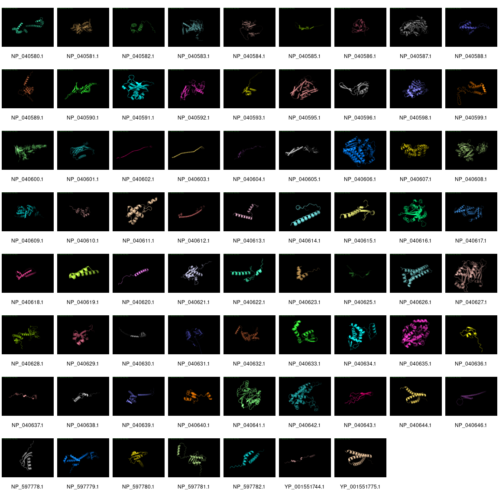

DeepMind's [AlphaFold](https://github.com/deepmind/alphafold) is winning at predicting tertiary structures from primary amino acid sequences. We thought it would be fun to investigate how it performed on phage Lambda.

We took the [NCBI version of &lambda;](https://www.ncbi.nlm.nih.gov/nuccore/NC_001416.1/) and extracted all the proteins, and then ran them through AlphaFold. It was able to make a prediction for all the proteins except for three proteins: [NP_040594.1](https://www.ncbi.nlm.nih.gov/protein/NP_040594.1/) (144 amino acids), [NP_040597.1](https://www.ncbi.nlm.nih.gov/protein/NP_040597.1/) (232 amino acids), and [NP_040645.1](https://www.ncbi.nlm.nih.gov/protein/NP_040645.1) (158 amino acids). 

As you can see, many of the structures are just predicted to be long alpha helices with little order, but some of the structures are complex and closer representation to the predicted structures.

There are, of course, a heap of caveats to this analysis, including the fact that we did not (at this time) filter out any of the [existing phage &lambda; structures](https://www.rcsb.org/search?request=%7B%22query%22%3A%7B%22type%22%3A%22group%22%2C%22nodes%22%3A%5B%7B%22type%22%3A%22group%22%2C%22nodes%22%3A%5B%7B%22type%22%3A%22group%22%2C%22nodes%22%3A%5B%7B%22type%22%3A%22terminal%22%2C%22service%22%3A%22full_text%22%2C%22parameters%22%3A%7B%22value%22%3A%22lambda%22%7D%7D%5D%2C%22logical_operator%22%3A%22and%22%7D%5D%2C%22logical_operator%22%3A%22and%22%2C%22label%22%3A%22full_text%22%7D%5D%2C%22logical_operator%22%3A%22and%22%7D%2C%22return_type%22%3A%22entry%22%2C%22request_info%22%3A%7B%22query_id%22%3A%22b43e87e4e767ce4d36b9d6816c4a9785%22%7D%2C%22request_options%22%3A%7B%22pager%22%3A%7B%22start%22%3A0%2C%22rows%22%3A25%7D%2C%22scoring_strategy%22%3A%22combined%22%2C%22sort%22%3A%5B%7B%22sort_by%22%3A%22score%22%2C%22direction%22%3A%22desc%22%7D%5D%7D%7D) so one would hope that those are really good!

You can [download all the best ranked structures](data/lambda_structures.zip) for phage Lambda so you can view them in your favorite structure viewer

